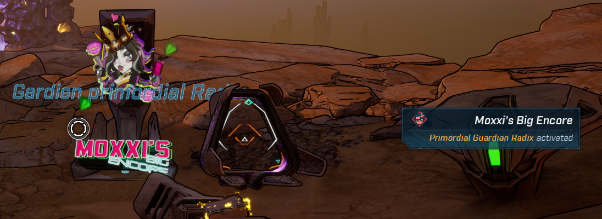

# Big Encore Enabler for Borderlands 4

**Big Encore Enabler** automatically enables **Moxxi's Big Encore** on loaded
Boss Replay machines when you approach them.

It does not start fights or change the weekly rotation. A small notification is
shown when a machine is activated.

## Installation

1. Close Borderlands 4.
2. Download the latest `BigEncoreEnabler-Full-Bundle-YYYYMMDD-HHMMSS.zip`
   release.
3. Extract it into your Borderlands 4 game folder and merge folders if asked.
4. Start the game. The mod is enabled automatically on first install and can
   later be managed from the in-game Mods menu.

The full bundle includes the required SDK/mod manager.

## Development

Run `build_release.ps1` on Windows after changing the mod to rebuild the full
drag-and-drop bundle. Use `build_plugin.ps1` when you only need the mod archive.

## Credits

Built with [Oak 2 Mod Manager / BL-SDK](https://github.com/bl-sdk/oak2-mod-manager).
See [THIRD-PARTY-NOTICES.md](THIRD-PARTY-NOTICES.md) for third-party notices.
